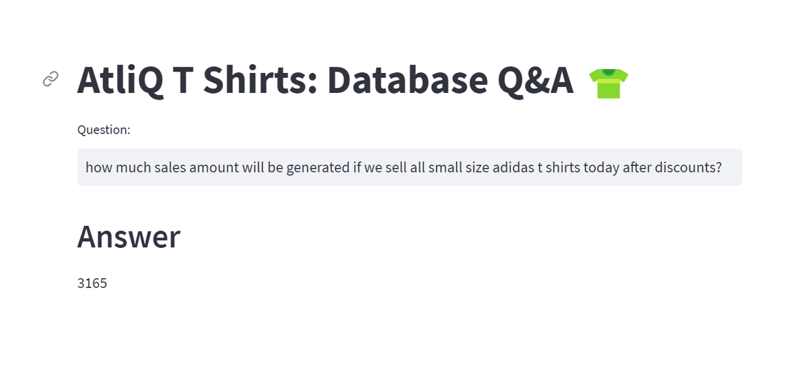

# 🧠 AtliQ Tees: Talk to a Database with LLMs

This project is an end-to-end **LLM-powered application** using **Google PaLM** and **Langchain** to interact with a **MySQL database** using natural language queries.

**AtliQ Tees** is a fictional T-shirt store that maintains its inventory, sales, and discounts data in a structured database. A store manager can ask natural language questions like:

- *How many white Adidas T-shirts are left in stock?*
- *What sales revenue would we generate by selling all extra-small T-shirts after discounts?*

The system automatically converts these questions into SQL queries, executes them on the database, and returns accurate responses.



---

## 🚀 Project Highlights

- AtliQ Tees sells T-shirts from:
  - **Adidas**
  - **Nike**
  - **Van Heusen**
  - **Levi's**
- All data (inventory, sales, discounts) is stored in **MySQL**.
- The Q&A system leverages:
  - 🧠 **Google PaLM LLM**
  - 🤗 **Hugging Face Embeddings**
  - 🌐 **Streamlit** for the user interface
  - 🔗 **Langchain** framework
  - 🧲 **ChromaDB** for vector storage
  - 🎯 **Few-shot learning** for enhanced prompt understanding

---

## 🛠️ Installation

1. **Clone the repository**
```bash
git clone https://github.com/noumannahmad/End-to-end-Gen-AI-project-Using-Langchain-Google-Palm-in-Retail-Industry-.git

```
2.Navigate to the project directory:

```bash
  cd 4_sqldb_tshirts
```
3. Install the required dependencies using pip:

```bash
  pip install -r requirements.txt
```
4.Acquire an api key through makersuite.google.com and put it in .env file

```bash
  GOOGLE_API_KEY="your_api_key_here"
```
5. For database setup, run database/db_creation_atliq_t_shirts.sql in your MySQL workbench

## Usage

1. Run the Streamlit app by executing:
```bash
streamlit run main.py

```

2.The web app will open in your browser where you can ask questions

## Sample Questions
  - How many total t shirts are left in total in stock?
  - How many t-shirts do we have left for Nike in XS size and white color?
  - How much is the total price of the inventory for all S-size t-shirts?
  - How much sales amount will be generated if we sell all small size adidas shirts today after discounts?
  
## Project Structure

- main.py: The main Streamlit application script.
- langchain_helper.py: This has all the langchain code
- requirements.txt: A list of required Python packages for the project.
- few_shots.py: Contains few shot prompts
- .env: Configuration file for storing your Google API key.
